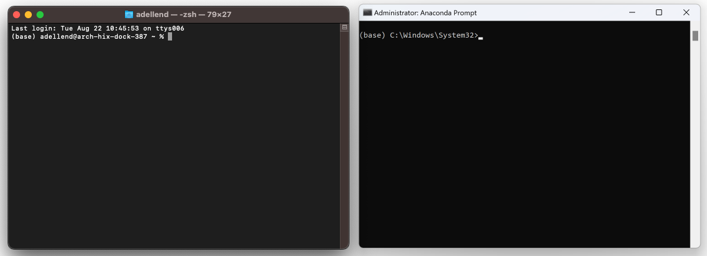

# CARBCOMN - COMPAS workshop

**Location**
Online on Microsoft Teams, link: [Join meeting](https://teams.microsoft.com/l/meetup-join/19%3ameeting_Yjc2OWUyMWItNDc5Ni00ZGE0LWJmM2QtZWQzMjY0NWVjOWZl%40thread.v2/0?context={"Tid"%3a"d7811cde-ecef-496c-8f91-a1786241b99c"%2c"Oid"%3a"ca685b01-a678-4687-b1d2-6957903a5a33"}) 

**Date**
* Wednesday 22nd January 2025

**Time**
* 🌅 9:00 to 12:00 - Morning Session
* 🍽️ 12:00 to 13:00 - Lunch Break
* 🌇 13:00 to 17:00 - Afternoon Session

**Slack**
* :loudspeaker: If you need help, please post a note in the CARBCOMN Slack workspace on the channel #compas-workshop: [Join Slack](https://join.slack.com/t/carbcomn/shared_invite/zt-2y3ux3dgm-kL0QBKTUDVqe39Xqk7biGQ)
 
&nbsp;

:exclamation: **Attention: Please install all software, before the workshop** :exclamation:
* [Part 1 - Requirements](#part-1---requirements)
* [Part 2 - Installation](#part-2---installation)

## Part 1 - Requirements

* Minimum OS: Windows 10 Pro or Mac OS Sierra 10.12
* [Anaconda 3](https://www.anaconda.com/), or miniconda if you prefer...
* [Visual Studio Code](https://code.visualstudio.com/) with the `Python` and `Pylance` extensions from Microsoft.
* [Rhino 8](https://www.rhino3d.com/download)

During the installation of the various tools, just accept all default settings.
The default location for installing Anaconda is usually in the home directory.
If it isn't, try to install it there anyway.
And make sure not to register it on the `PATH` (Windows only).
On Windows, the path to the home directory is stored in the variable `%USERPROFILE%`.
On Mac, it is accessible through `~`.
This results in the following recommended installation directories for Anaconda.

*On Windows*

```
%USERPROFILE%\Anaconda3
```

*On Mac*

```
~/anaconda3
```

## Part 2 - Installation

**The command prompt**

Many instructions in the next sections will have to be run from "the command prompt".

On Windows, use the "Anaconda Prompt" instead of the "Command Prompt", and make sure to run it *as administrator*.

> To find the Anaconda Prompt open the Start Menu and type "Anaconda".
> The Anaconda Prompt should already show up in the list of search results.
> To launch it as administrator, right click and select "Run as administrator".

On Mac, use the "Terminal".

**For simplicity, this guide will refer to both Terminal and Anaconda Prompt as "the command prompt".**



We will use the command prompt to install the COMPAS Python packages (and their dependencies) required for the workshop.

> **NOTE**: If you're on Windows, all commands below have to be executed in the *Anaconda Prompt* (NOT in the *Command Prompt*)

We use `conda` to make sure we have clean, isolated environment for dependencies.

Download the workshop files by cloning the GitHub repository in the desired folder.
Type the following line in the command prompt and press enter:

    git clone https://github.com/BlockResearchGroup/CARBCOMN.git

Then create the workshop environment and install the dependencies.

On Windows, type in the command prompt:

    conda env create -f env_win.yml

On Mac, type:

    conda env create -f env_notwin.yml

### Verify installation

Activate the environment in the command prompt:

    conda activate carbcomn

> **NOTE**: You should see that your prompt changed from `(base)` to `(carbcomn)`

Run the verification command `python -m compas`:

    (carbcomn) python -m compas

    Yay! COMPAS is installed correctly!

    COMPAS: 2.8.1
    Python: 3.10.14 (CPython)
    Extensions: ['compas-assembly', 'compas-cra', 'compas-tna', 'compas-dr', 'compas-fd', 'compas-ifc', 'compas-viewer', 'compas', 'compas-occ', 'compas-notebook', 'compas-model']


### Updates

The CARBCOMN github repository will be updated with new files and examples. 
To pull the new content from the repository, in the command prompt, go to the folder where you cloned the repository, 
and with the carbcomn environment active, type:

    git pull origin main

In the case of changes in the environment files, the carbcomn environment can be updated by typing:

On Windows:

    conda env update -f env_win.yml

On Mac:

    conda env update -f env_notwin.yml


  


